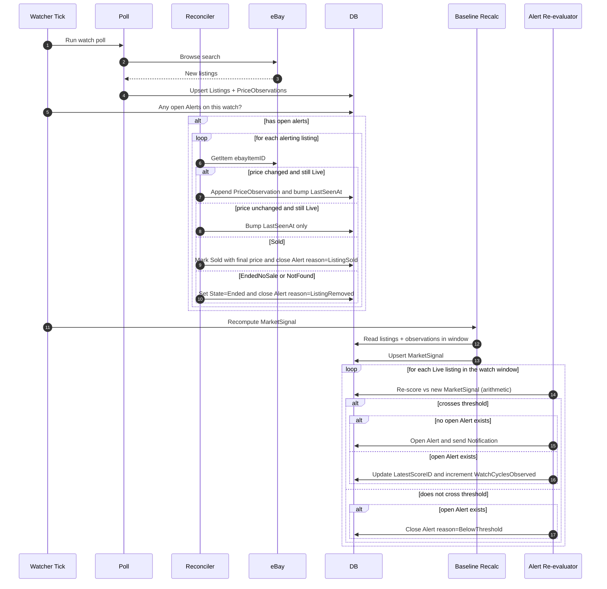
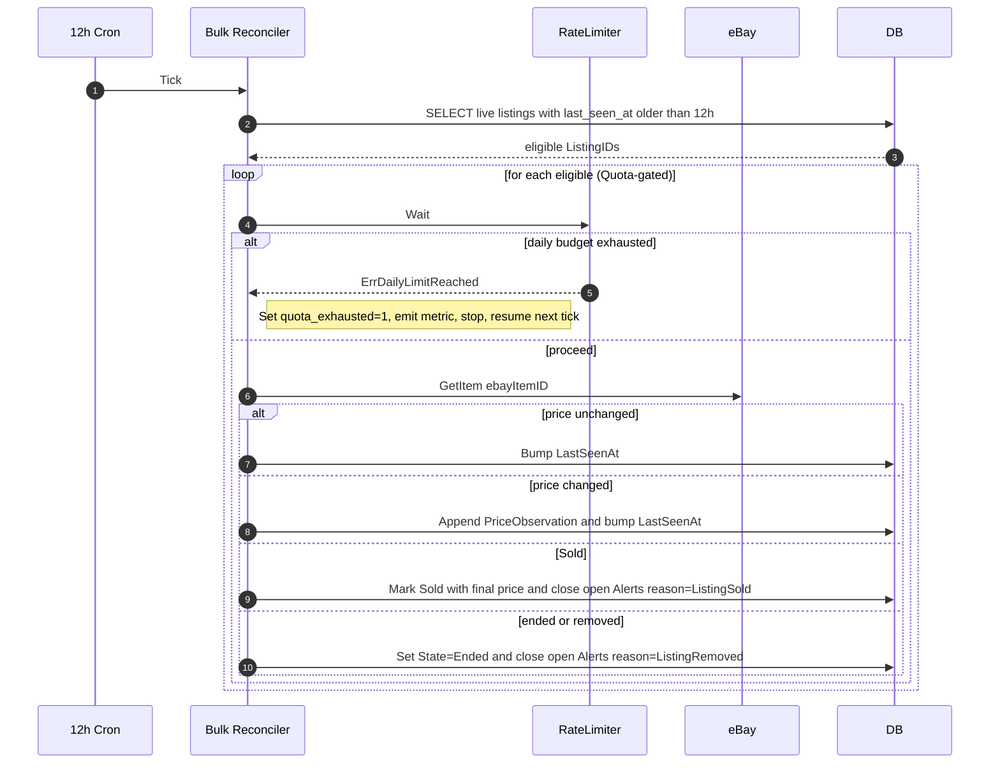

<!-- markdownlint-disable-file MD025 MD041 -->

# DESIGN 0004: Alert and reconciliation pipeline

**Status:** Draft
**Author:** Donald Gifford
**Date:** 2026-05-24

<!--toc:start-->
- [Overview](#overview)
- [Goals and Non-Goals](#goals-and-non-goals)
  - [Goals](#goals)
  - [Non-Goals](#non-goals)
- [Background](#background)
- [Detailed Design](#detailed-design)
  - [Two flows, one quota](#two-flows-one-quota)
  - [Flow A: Per-watcher alert reconciliation](#flow-a-per-watcher-alert-reconciliation)
  - [Flow B: 12-hour bulk reconciliation](#flow-b-12-hour-bulk-reconciliation)
  - [Quota budget and prioritization](#quota-budget-and-prioritization)
  - [Terminal-state inference from getItem](#terminal-state-inference-from-getitem)
  - [Alert lifecycle and notifications](#alert-lifecycle-and-notifications)
  - [Stale Alert detection](#stale-alert-detection)
  - [Stage definitions](#stage-definitions)
  - [Failure handling](#failure-handling)
- [API / Interface Changes](#api--interface-changes)
- [Data Model](#data-model)
- [Testing Strategy](#testing-strategy)
- [Migration / Rollout Plan](#migration--rollout-plan)
- [Open Questions](#open-questions)
  - [Resolved](#resolved)
  - [Still open](#still-open)
- [References](#references)
<!--toc:end-->

## Overview

Defines the two reconciliation flows that keep spt's listing state and alerts accurate against eBay: a per-watcher alert-driven flow that re-fetches alerting listings at the start of each cycle, and a 12-hour bulk flow that sweeps all live listings to catch sales and price drift. Both share the eBay `buy.browse` quota and must coexist with the watch-poll workload; this doc owns that budget split and the resulting flow choreography.

## Goals and Non-Goals

### Goals

- Keep open Alerts accurate: detect price changes, sales, and listing removal in time to update the operator-visible state and close the alert correctly.
- Capture sell-price data points for analytics — sale events are the highest-value signal for "what's this stuff actually worth?"
- Detect general listing drift (price changes on non-alerting listings) so MarketSignal baselines stay current without hammering eBay.
- Respect the daily eBay quota, with a clear prioritization policy when budget is tight.
- Expose the quota state and any forced degradations as first-class metrics so an operator can see and alert on them.

### Non-Goals

- The watch-poll itself (`StagePoll` / `StageExtract` / `StageScore`) — covered by [DESIGN-0005 — Pipeline orchestrator and worker model](0005-pipeline-orchestrator-and-worker-model.md).
- The notification delivery mechanism (channels, retries, templates) — separate doc when we wire it.
- Re-extraction or re-scoring on a price change. Price updates append a `PriceObservation`; baselines re-aggregate naturally. Re-extraction is only triggered by extractor-version bumps, which is a different flow.
- Multi-instance coordination — handled by [DESIGN-0005 — Pipeline orchestrator and worker model](0005-pipeline-orchestrator-and-worker-model.md) (the bulk-reconcile cron is leader-only; alert reconciliation runs as part of the per-Watch DAG and inherits the worker pool's parallelism semantics).

## Background

[RFC-0001](../rfc/0001-server-price-tracker-platform.md) describes spt's market data needs at a high level. [DESIGN-0002](0002-domain-and-pipeline-type-system.md) defines the types this flow operates on: `Listing` with its four-state `ListingState`, `PriceObservation` for price history, `Alert` with its lifecycle counters, `MarketSignal` for baseline analytics. [DESIGN-0003](0003-ebay-api-client.md) adds the `GetItem` endpoint to the eBay client specifically to support this flow.

The prior version of spt did not have a structured reconciliation pipeline — listings were observed via the watch poll and inferred-sold when they stopped appearing, which both missed sell-prices and was sloppy about ended-no-sale detection. This design closes those gaps.

## Detailed Design

### Two flows, one quota

| Flow | Trigger | Coverage | Priority |
|------|---------|----------|----------|
| **A. Per-watcher alert reconciliation** | Start of each watcher cycle (after poll, before recalc) | Only listings with open Alerts on this watch | High (alerts are user-visible state) |
| **B. 12-hour bulk reconciliation** | Cron, every 12h (offset 2h under eBay's 24h reset) | All live listings with `last_seen_at < now - 12h` | Low (drift-detection; degrades first when quota is tight) |

Both flows use the same eBay `GetItem` endpoint and consume the same `buy.browse` quota that watch polls draw from. The rate limiter ([DESIGN-0003](0003-ebay-api-client.md) — Valkey-backed) is shared.

### Flow A: Per-watcher alert reconciliation

Runs once per watcher cycle, between poll and baseline recalc. Re-fetches every listing with an open Alert on this watch.



**Re-evaluation runs against ALL live listings in the watch's window, not just currently-alerting ones.** This is the model that makes the alert state always reflect "does this listing cross the threshold against the *current* baseline?". If a baseline drop now puts a previously-quiet listing into alert range, we open a new Alert this cycle. If a baseline rise pushes a previously-alerting listing out of range, we close it. The two-pass approach (reconcile alerting first, then re-evaluate everything) is replaced by a single re-eval pass over all Live listings.

**Sold and Ended listings never alert.** Re-eval considers only listings with `State == Live`. Reconciliation in the earlier pass has already moved any sold/ended listings out of `Live`, so they're naturally excluded.

**Re-evaluation is arithmetic, not a re-scoring pass.** No LLM call, no extractor run. The existing `Score.Value` and `Score.Percentile` are compared against the freshly-recomputed `MarketSignal.Percentiles[N]` for the threshold check.

**Order matters.** Reconcile *before* recalc (so the baseline includes any reconciliation-driven price updates). Re-evaluate *after* recalc (so we evaluate against the new baseline). The "open new alerts" step folds into re-evaluation now — there's no separate pass.

**The one-cycle delay between alert open and first reconciliation is intentional.** Cycle N opens the alert; cycle N+1 reconciles it. This gives the listing time to evolve naturally (new bids on auctions, the seller might drop the price) and saves a `GetItem` call that often wouldn't tell us anything new.

### Flow B: 12-hour bulk reconciliation

Independent cron, separate role responsibility (likely the scheduler emits a synthetic Job at the cron tick; workers pick up `StageReconcileBulk` Tasks).



**Why 12h, skewed 2h under eBay's 24h window:** eBay resets `buy.browse` quota at midnight Pacific. Running the bulk every 12h with a 2h skew (so it doesn't land right at the reset boundary, when state is most likely to be inconsistent between local counters and eBay's view) gives every live listing at least one daily check while still leaving an obvious window for watch polls to dominate.

**Why a `last_seen_at < now - 12h` predicate:** if Flow A or a watch re-poll already touched the listing in the last 12h, the bulk skips it. This keeps the bulk's per-tick workload bounded by *actual* staleness, not total live-listing count.

### Quota budget and prioritization

The `buy.browse` quota is shared across:

| Consumer | Approx daily cost (rough order of magnitude) | Degradation behavior |
|----------|----------------------------------------------|----------------------|
| Watch polls (`StagePoll`) | (# watches) × (avg pages per poll) × (polls per day) | None — polls are the core product; if they fail we lose freshness |
| Alert reconciliation (Flow A) | (# open alerts) × (cycles per day per watch) | None — alerts must be accurate |
| Bulk reconciliation (Flow B) | (# stale live listings) × 1 (per 12h tick) | **Defers when budget tight** |

**Budget rule:** allocate a `reconciliation_max_daily_calls` config knob (default: 30% of the configured eBay daily limit, or the bulk's natural workload, whichever is smaller). The bulk reconciler:

1. Tracks its own daily consumption in Valkey: `spt:reconcile:bulk:daily_count`.
2. Before each `GetItem`, checks `bulk_count < min(reconciliation_max_daily_calls, quota_remaining)`.
3. If exceeded, stops the current sweep and emits a `spt_reconcile_bulk_deferred_total{reason}` counter increment. Resumes next tick.

Flow A is unconditional within the global daily quota — it gets the budget watch polls don't use. If the global daily quota is *fully* exhausted while Flow A is running (e.g., one alerting listing returns `ErrDailyLimitReached` mid-loop), Flow A stops, the recalc step still runs (against possibly-stale data — that's fine, the next cycle catches up), and alerts that couldn't be reconciled stay in their previous state with no synthetic close.

**Metrics:**

- `spt_reconcile_alerts_total{watch_id, outcome}` — outcome ∈ `price_changed | unchanged | sold | ended | not_found | quota_exhausted`
- `spt_reconcile_bulk_total{outcome}` — same set
- `spt_reconcile_bulk_deferred_total{reason}` — reason ∈ `budget_exhausted | global_quota_exhausted`
- `spt_reconcile_duration_seconds{flow}` — histogram, flow ∈ `alert | bulk`
- (Reuses `spt_ebay_quota_exhausted{marketplace}` from DESIGN-0003 for the global quota signal.)

### Terminal-state inference from getItem

DESIGN-0003 leaves terminal-state inference to the caller (i.e., this flow). The rules:

| eBay response signal                                  | Inferred `ListingState`  | SoldPrice           | Notes |
|-------------------------------------------------------|--------------------------|---------------------|-------|
| HTTP 404 (`ErrItemNotFound`)                          | `NotFound`               | nil                 | Pulled from eBay (seller deleted, eBay removed, etc.) |
| 200, `availabilityStatus = "OUT_OF_STOCK"`            | `Sold`                   | from `price.value`  | Listing ended via sale; final price is the sale price. Common for Buy-It-Now. |
| 200, `availabilityStatus` absent, `itemEndDate` past, `bidCount > 0` | `Sold`     | from `price.value`  | Ended auction with bids. Final price = winning bid. |
| 200, `availabilityStatus` absent, `itemEndDate` past, `bidCount == 0` | `EndedNoSale` | nil              | Ended auction with no bids. |
| 200, `availabilityStatus = "AVAILABLE"`               | `Live` (no state change) | n/a                 | Still listed; just update `LastSeenAt` and (if changed) price. |

eBay's exact response shape for ended listings is somewhat inconsistent across listing types; the integration tests must include real ended-listing fixtures to validate this table. Where uncertainty remains at runtime, prefer the conservative inference (`Live` if ambiguous) — the next reconciliation cycle catches it.

### Alert lifecycle and notifications

The Alert is a **derived state**: "this Live listing currently crosses the watch's alert threshold against the current MarketSignal baseline". An Alert exists iff that condition holds; it ceases to exist (closes) the moment the condition stops holding.

**Notifications fire on state transitions, not on continued state.**

| Transition | Notification |
|------------|--------------|
| no Alert → open Alert (listing newly crosses threshold) | **Send.** This is the entire reason notifications exist. |
| open Alert → still open (continues to cross) | No notification. Update `LatestScoreID` and increment `WatchCyclesObserved`. |
| open Alert → closed, reason=BelowThreshold (score no longer crosses) | Optional close notification, per channel config. Off by default. |
| open Alert → closed, reason=ListingSold | Optional close notification ("the deal you were watching just sold"). Off by default. |
| open Alert → closed, reason=ListingRemoved | Optional close notification. Off by default. |
| open Alert → still open AND stale (reconciliation failed) | No alert-channel notification — but emit `spt_alerts_stale_total{watch_id}` for ops. |

No re-notification cooldown, no "score improved" overrides, no 24h windows. If a listing keeps crossing the threshold, we keep that Alert open; we don't keep nagging the user about the same listing.

**Counter update rules:**

| Counter | When updated |
|---|---|
| `WatchCyclesObserved` | Incremented at the end of every watcher cycle where the Alert exists at the start and is still-crossing-threshold at re-eval time. Not incremented on the cycle the Alert was opened. |
| `NotificationsSent` | Incremented each time a Notification record is dispatched (i.e., on every open transition; on close transitions only if close-notifications are enabled). |
| `LastNotifiedAt` | Set to the notification time on every send. |
| `LatestScoreID` / `LatestScoreValue` | Updated on every re-evaluation, regardless of whether the Alert changes state. |

### Stale Alert detection

An Alert is **stale** when the most recent reconciliation attempt for its listing failed (eBay 5xx, network error, quota exhaustion). The data underlying the alert may be wrong; the operator should know.

`Alert` carries three additional fields ([DESIGN-0002](0002-domain-and-pipeline-type-system.md) will be updated to include these):

```go
Stale              bool        // true if the last reconciliation attempt failed
LastReconciledAt   *time.Time  // wall time of the last reconciliation attempt (success OR failure)
LastReconcileError string      // populated when Stale = true; cleared on next success
```

**Stale-setting rules:**

- After a successful reconciliation attempt: `Stale = false`, `LastReconciledAt = now`, `LastReconcileError = ""`.
- After a failed reconciliation attempt: `Stale = true`, `LastReconciledAt = now`, `LastReconcileError = err.Error()`.
- The next successful reconciliation clears `Stale`.

**Metrics:**

- `spt_alerts_stale_total{watch_id}` — gauge; count of open Alerts with `Stale = true` per watch.
- `spt_alerts_open_total{watch_id}` — gauge; count of open Alerts per watch (for ratio with stale).

The Helm chart ships a default alert rule on sustained `spt_alerts_stale_total > 0` (e.g., for > 30m) so operators know when alert correctness has drifted.

### Stage definitions

New pipeline stages introduced by this flow (extending the enum in DESIGN-0002):

```go
const (
    // ... existing stages ...
    StageReconcileAlerts  Stage = "reconcile_alerts"   // Flow A: re-fetch alerting listings via GetItem
    StageReconcileBulk    Stage = "reconcile_bulk"     // Flow B: 12h bulk sweep
    StageEvalAlerts       Stage = "eval_alerts"        // arithmetic re-eval over all Live listings; opens/closes Alerts
)
```

`StageEvalAlerts` is one stage, not two. Re-evaluation iterates every Live listing in the watch's window and opens, updates, or closes Alerts as scores cross or fall away from thresholds. There's no separate "open new alerts" pass — the same code that closes a no-longer-crossing alert also opens a newly-crossing one.

DAG addition to the per-watcher cycle:

```
poll ──▶ extract ──┬──▶ score ──┐
                   │            │
                   │            ▼
                   │       reconcile_alerts   (only if open alerts exist for this watch)
                   │            │
                   │            ▼
                   │          recalc ──▶ eval_alerts
                   │
                   └──▶ index
```

And independently, on a 12h cron:

```
cron(12h) ──▶ reconcile_bulk
```

(The orchestrator handles this DAG; the stages themselves are independent Task handlers per [DESIGN-0002](0002-domain-and-pipeline-type-system.md).)

### Failure handling

| Failure | Behavior |
|---------|----------|
| eBay returns 5xx mid-Flow-A loop | Retry per the eBay client's retry policy. If retries exhaust, log ERROR with the wrapped error, skip the listing, continue the loop. Recalc proceeds with whatever was reconciled. |
| `ErrDailyLimitReached` mid-Flow-A | Stop the loop. Mark `spt_ebay_quota_exhausted=1`. Recalc still runs. Unreconciled alerts retain prior state. |
| `ErrDailyLimitReached` mid-Flow-B | Stop the sweep. Increment `spt_reconcile_bulk_deferred_total{reason=global_quota_exhausted}`. Resume next 12h tick. |
| Postgres unreachable | Block the entire cycle. We don't have a fallback persistence layer; failing fast is the right behavior. Per the sentinel-error rule in [DESIGN-0001](0001-go-application-layout-and-conventions.md), log at ERROR. |
| Reconciler crashes mid-cycle | The cycle is idempotent on Listing/PriceObservation upserts (UPSERT on `(listing_id, observed_at)`); restart resumes the next watcher tick. Open Alerts that weren't reconciled stay open with stale state until next cycle. |
| `getItem` returns ambiguous state | Prefer `Live` (conservative). Log INFO with the raw response for later analysis. Next reconciliation cycle catches it. |

## API / Interface Changes

This document doesn't introduce new public API surfaces. It composes existing interfaces:

- Adds methods to the `Datastore` interface ([DESIGN-0002](0002-domain-and-pipeline-type-system.md)):
  - `ListingsForBulkReconcile(ctx, olderThan time.Time, limit int) ([]Listing, error)`
  - `ListingsWithOpenAlerts(ctx, watchID WatchID) ([]Listing, error)`
  - `AppendPriceObservation(ctx, obs PriceObservation) error`
  - `MarkListingSold(ctx, id ListingID, soldPrice Money, soldAt time.Time) error`
  - `MarkListingEnded(ctx, id ListingID, state ListingState, endedAt time.Time) error`
  - `CloseAlertsForListing(ctx, id ListingID, reason AlertCloseReason) error`
  - `IncrementAlertCycle(ctx, id AlertID, latestScoreID ScoreID, latestValue apd.Decimal) error`

- Reuses `Client.GetItem` from [DESIGN-0003](0003-ebay-api-client.md).
- Reuses `RateLimiter` from [DESIGN-0003](0003-ebay-api-client.md).

## Data Model

No new tables. Uses the schemas defined in [DESIGN-0002](0002-domain-and-pipeline-type-system.md):

- `listings` (with `state`, `sold_price_*`, `sold_at`, `ended_at`, `last_seen_at`)
- `price_observations` (composite PK `(listing_id, observed_at)`)
- `alerts` (with `watch_cycles_observed`, `notifications_sent`, `last_notified_at`)
- `market_signals`

Indices that matter for this flow (already specified in DESIGN-0002):

- `listings_reconcile_idx ON listings (state, last_seen_at) WHERE state = 0` — drives Flow B's eligible-listing query.
- `alerts_open_by_watch_idx ON alerts (watch_id) WHERE state = 0` — drives Flow A's open-alerts query.

## Testing Strategy

**Unit tests:**

- Flow A: mocked `eBay.Client` + `Datastore`. Table-driven cases per terminal-state row above (price-changed, sold, ended-no-sale, not-found, quota-exhausted mid-loop). Verify Alert closes happen exactly when expected.
- Flow B: mocked `eBay.Client` + `RateLimiter` + `Datastore`. Cases: budget exhaustion mid-sweep, global quota exhaustion mid-sweep, eligible-listing predicate correctness.
- Terminal-state inference: a dedicated test against synthetic `Item` payloads matching each row of the inference table.
- Re-notification cooldown: table-driven cases for the four matrix rows.

**Integration tests** (`//go:build integration`):

- One end-to-end watcher cycle against a Compose stack: Postgres + Valkey + a **rewritten mock eBay server** (under `tools/mock-server/`). The prior version of spt had a minimal mock (OAuth + search only); the rewrite needs to additionally mock:
  - `GET /buy/browse/v1/item/{item_id}` — with scriptable responses per `item_id` (Live with current price, Live with changed price, Sold + final price, EndedNoSale, 404).
  - `GET /developer/analytics/v1_beta/rate_limit/` — returning controllable quota values.
  - Optional latency injection and 5xx fault injection via query params or request headers.
  - Multi-fixture loading (per-scenario fixture directories rather than one baked-in file).
- Verify: alert opens → next cycle reconciles → sold detection → alert closes with correct reason → `SoldPrice` persisted; bulk sweep deferral when quota tight; Stale set on simulated `GetItem` 5xx.

**Eval / behavioral test (manual, periodic):**

- Curated dataset of real ended eBay listings (frozen API responses captured into the mock-server's fixture directory). Validate the inference table holds against actual eBay payloads over time as eBay's response shapes drift.
- Optional: seed from the prior-version spt DB (see Rollout) and verify the new pipeline produces sensible Scores and Alerts on real historical data.

## Migration / Rollout Plan

**Both Flow A and Flow B ship in v1.** They serve different purposes: Flow A keeps the alert state correct against the current baseline (high-stakes correctness); Flow B catches sold listings and price drift on the long tail of non-alerting listings (data quality for analytics). One without the other leaves a real gap — Flow A alone misses sell-prices on the listings the user *didn't* alert on; Flow B alone leaves alert state stale between bulk runs.

Flow B's natural delay solves the cold-start question: on a fresh deploy with no listings, Flow B has nothing to do for the first 12h. By the time the first sweep fires, watch polls have populated the listing set and the bulk has real work.

**Seeding from the prior-version DB (optional).** A migration tool that reads the prior spt's Postgres `listings` table and inserts them into the new schema (with `RawPayload = NULL` and `last_seen_at = now`) would give us:

1. Real test data for both reconciliation flows from day one.
2. A historical price corpus to validate MarketSignal computation against.
3. A regression test set: a known-good listing from the old DB should score similarly under the new extractor.

Optional, not required. Worth a small tool in `tools/migrate-from-v1/` if we want it.

The 12h cron cadence and the `reconciliation_max_daily_calls` default are tunable from the start; expect to revisit both after first contact with real-traffic quota patterns.

## Open Questions

### Resolved

- **✅ Re-notification policy.** Removed. Notifications fire on the no-alert → open-alert transition only; staying-open does not re-notify. The model "an Alert *is* the state of crossing-threshold-against-current-baseline" makes the per-cycle nag-or-don't-nag question moot.
- **✅ Failed reconciliation visibility.** Resolved: add `Stale`, `LastReconciledAt`, and `LastReconcileError` to `Alert`, plus `spt_alerts_stale_total` Prometheus gauge. UI exposes a stale badge on alerts; Helm chart ships a default alert rule on sustained stale state.
- **✅ Backfill / cold start.** Mooted by Flow B's 12h cadence — fresh deploys naturally accumulate listings before the first bulk sweep. Optional seeding from the prior-version DB documented under Rollout.
- **✅ Both flows in v1.** Phased rollout (Flow A first, Flow B later) rejected — they serve different concerns and one without the other leaves a real gap.

### Still open

- **eBay `getItem` payload fidelity for ended-no-sale auctions.** The terminal-state inference table is hypothesized; needs validation against real ended-listing fixtures. The integration test suite (using the mock-server, see Testing Strategy) will capture this; table may need refinement after first contact with real data.
- **Quota budget default value.** `reconciliation_max_daily_calls` defaults to 30% of the configured eBay daily limit — picked as a reasonable starting fraction. Real-traffic data will tell us if it's the right split. Tunable from day one; not blocking.

## References

- [RFC-0001 — Server Price Tracker Platform](../rfc/0001-server-price-tracker-platform.md)
- [ADR-0005 — Use Valkey for queues and caching](../adr/0005-use-valkey-for-queues-and-caching.md)
- [ADR-0008 — Use OTel + ClickHouse + Langfuse for agent observability and evals](../adr/0008-use-otel-clickhouse-langfuse-for-agent-observability-and-evals.md)
- [ADR-0012 — Build a custom scheduler and pipeline orchestrator](../adr/0012-build-a-custom-scheduler-and-pipeline-orchestrator.md)
- [DESIGN-0001 — Go application layout and conventions](0001-go-application-layout-and-conventions.md)
- [DESIGN-0002 — Domain and pipeline type system](0002-domain-and-pipeline-type-system.md)
- [DESIGN-0003 — eBay API client](0003-ebay-api-client.md)
- [DESIGN-0005 — Pipeline orchestrator and worker model](0005-pipeline-orchestrator-and-worker-model.md)
