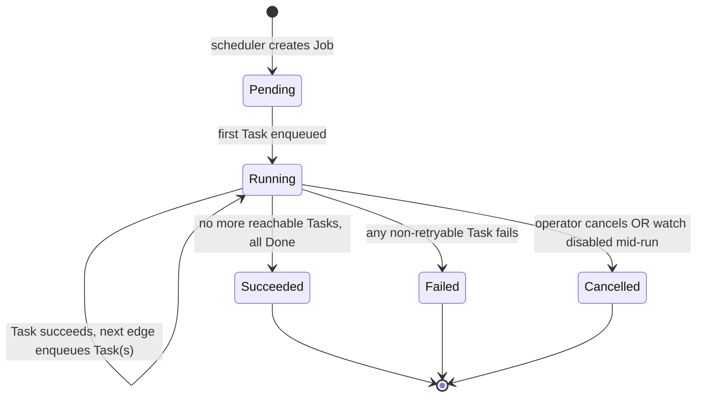
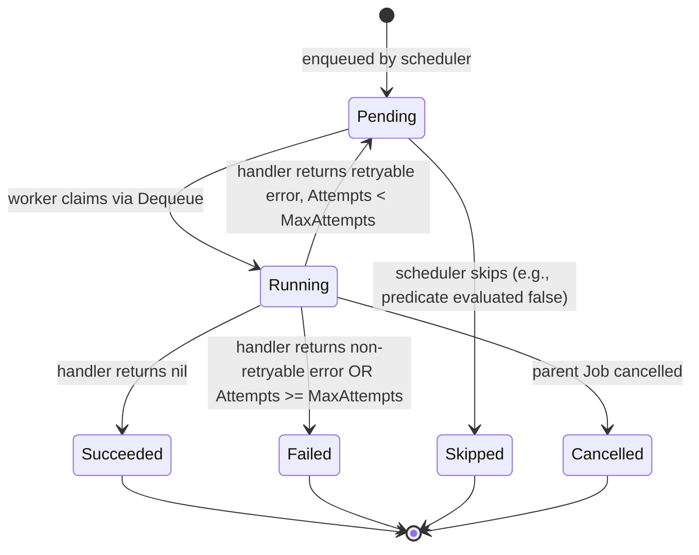

<!-- markdownlint-disable-file MD025 MD041 -->

# DESIGN 0005: Pipeline orchestrator and worker model

**Status:** Draft
**Author:** Donald Gifford
**Date:** 2026-05-25

<!--toc:start-->
- [Overview](#overview)
- [Goals and Non-Goals](#goals-and-non-goals)
  - [Goals](#goals)
  - [Non-Goals](#non-goals)
- [Background](#background)
- [Detailed Design](#detailed-design)
  - [Architecture at a glance](#architecture-at-a-glance)
  - [DAG topology in code](#dag-topology-in-code)
  - [Job lifecycle](#job-lifecycle)
  - [Task lifecycle and retries](#task-lifecycle-and-retries)
  - [Conditional edges and sampling](#conditional-edges-and-sampling)
  - [Worker pool model](#worker-pool-model)
  - [Stage handoff: Valkey-mediated](#stage-handoff-valkey-mediated)
  - [Multi-instance scaling and leader election](#multi-instance-scaling-and-leader-election)
  - [Crash recovery](#crash-recovery)
  - [OTel span model](#otel-span-model)
  - [Metrics](#metrics)
- [API / Interface Changes](#api--interface-changes)
- [Data Model](#data-model)
- [Testing Strategy](#testing-strategy)
- [Migration / Rollout Plan](#migration--rollout-plan)
- [Open Questions](#open-questions)
  - [Resolved](#resolved)
- [References](#references)
<!--toc:end-->

## Overview

Defines the orchestrator (`spt scheduler` role) and worker (`spt worker` role) execution model — how Jobs are created, how their DAG is walked, how Tasks are dispatched, how failures are retried, how stages hand off data, and how all of it scales when more than one spt instance is running. This is the doc [ADR-0012](../adr/0012-build-a-custom-scheduler-and-pipeline-orchestrator.md) promised as "follow-up" and the one [DESIGN-0003](0003-ebay-api-client.md) and [DESIGN-0004](0004-alert-and-reconciliation-pipeline.md) point to for orchestration semantics and multi-instance scaling.

## Goals and Non-Goals

### Goals

- A concrete executor model that walks the DAG defined in [DESIGN-0002](0002-domain-and-pipeline-type-system.md) and [DESIGN-0004](0004-alert-and-reconciliation-pipeline.md), with conditional edges (judge sampling, notify thresholds) and stage-to-stage data passing.
- Per-stage retry and failure semantics that match each stage's cost profile (cheap arithmetic vs. paid LLM calls vs. quota-bounded eBay calls).
- A worker model that lets us scale CPU-heavy stages (extract) independently of cheap ones (index, eval_alerts).
- Multi-instance safety from v1 — running two spt deployments against the same Postgres + Valkey must not double-poll watches, double-sync eBay quota, or duplicate-notify on Alerts.
- OTel trace shape that mirrors the DAG: one trace per Job, one span per Task.
- Clean crash recovery — scheduler or worker death cannot lose a Job permanently or duplicate side-effecting work.

### Non-Goals

- The stage handler implementations themselves (extractor prompts, scoring algorithm, judge prompt) — those live in their own packages and DESIGN docs.
- A generic workflow engine. The DAG is hard-coded for spt's pipeline; we are explicitly not building a framework.
- Streaming or sub-second SLAs. Watch polls fire on cadences measured in minutes-to-hours; this orchestrator is built for steady throughput, not low-latency request handling.
- Alternative queue backends. Valkey is the queue per [ADR-0005](../adr/0005-use-valkey-for-queues-and-caching.md); this doc assumes Valkey semantics.

## Background

[ADR-0012](../adr/0012-build-a-custom-scheduler-and-pipeline-orchestrator.md) committed us to a custom orchestrator after [INV-0001](../investigation/0001-scheduler-river-vs-custom-vs-alternatives.md) found that flat job queues (River, Asynq) are the wrong primitive for our DAG. [DESIGN-0002](0002-domain-and-pipeline-type-system.md) defined the `Job`/`Task`/`Stage`/`Queue`/`Scheduler` types and interfaces. [DESIGN-0004](0004-alert-and-reconciliation-pipeline.md) added three more stages (`reconcile_alerts`, `reconcile_bulk`, `eval_alerts`) and the DAG addendum that drives the alert flow.

The deferred questions across those docs cluster into four buckets:

1. **Executor model** — does the scheduler walk the DAG in-process and only push leaf-stage execution to workers, or does every stage round-trip through Valkey?
2. **Retry and failure semantics** — what's the per-stage retry policy and what counts as "permanent" failure?
3. **Multi-instance coordination** — leader election for the scheduler tick, the eBay `Sync()` call, the 12h bulk-reconcile cron, and the per-watch `next_run_at` claim.
4. **Crash recovery** — what state survives a scheduler restart, a worker restart, a Valkey blip, a Postgres failover?

This doc resolves all four.

## Detailed Design

### Architecture at a glance

```
┌────────────────────┐                          ┌─────────────────────────────┐
│  spt scheduler     │                          │   spt worker (Nx replicas)  │
│  (1 active leader) │                          │   ┌─────────────────────┐   │
│  ┌──────────────┐  │   3. INSERT Task         │   │ poller pool         │   │
│  │ Trigger loop │  │ ──────────────────┐      │   │ extractor pool      │   │
│  │ DAG walker   │  │ ─────────┐        │      │   │ scorer pool         │   │
│  │ Sync cron    │  │          │        │      │   │ judge pool          │   │
│  │ Bulk cron    │  │          │        │      │   │ index pool          │   │
│  └──────────────┘  │          │        │      │   │ notify pool         │   │
└─────────┬──────────┘          │        │      │   │ reconcile pool      │   │
          │                     │        │      │   │ eval_alerts pool    │   │
          │ 5. SUB task_complete│        │      │   └─────────┬───────────┘   │
          │                     │        │      │             │               │
          │           ┌─────────▼──────┐ │      │  4. BLMOVE  │ TaskID        │
          │           │     Valkey     │◄┼──────┼─────────────┘               │
          │           │                │ │ 4. PUB task_complete               │
          │           │ queues:        │◄┼──────┼─────────────┐               │
          │           │  stage:<s>     │ │      │             │               │
          │           │  claimed:<s>   │ │      │             │               │
          │           │ pub/sub:       │ │      │  ┌──────────▼──────────┐   │
          │           │  task_complete │ │      │  │ stage handler       │   │
          │           │ locks          │ │      │  │ (reads Task.input,  │   │
          │           └────────────────┘ │      │  │  writes Task.output)│   │
          │                              │      │  └──────────┬──────────┘   │
          │                              │      └─────────────┼──────────────┘
          │                              │                    │
          │                              │ 2. INSERT          │ 1. SELECT input
          │                              │    task(input)     │    UPDATE output
          │                              │                    │
          │              ┌───────────────▼────────────────────▼─┐
          └─────────────►│           Postgres                   │
                         │  jobs / tasks / domain data          │
                         │  (Task.input, Task.output payloads)  │
                         └──────────────────────────────────────┘
```

**Two roles, one binary.** `spt scheduler` runs the trigger loop, the DAG walker, the eBay Sync cron, and the 12h bulk-reconcile cron. `spt worker` runs the per-stage worker pools that pull `Task`s off Valkey and run their handlers. Both are the same `spt` binary — selected by cobra subcommand per [DESIGN-0001](0001-go-application-layout-and-conventions.md).

**Valkey is the queue workers pull from.** Each stage has its own Valkey LIST (`spt:queue:stage:<stage>`). Workers `BLMOVE` `TaskID`s off those lists into a per-worker claimed list with a lease TTL. **Postgres holds the Task payloads** (`tasks.input`, `tasks.output`) — workers read the input from Postgres after claiming the `TaskID`, run the handler, and write the output back. The queue messages themselves are just IDs; this keeps Valkey memory small and gives us Postgres's durability for the actual stage data. Full read/write sequence in [Stage handoff](#stage-handoff-valkey-mediated).

**One active scheduler at a time.** A Postgres advisory lock (`pg_try_advisory_lock(SCHEDULER_LOCK_ID)`) is held by exactly one scheduler instance. Other scheduler replicas block on it as warm standby — if the leader dies, the next-in-line acquires the lock and resumes. See [Multi-instance scaling](#multi-instance-scaling-and-leader-election).

**N worker replicas, all active.** Workers are stateless and share the Valkey queues. The `Dequeue` contract (atomic claim via `BLMOVE` per [DESIGN-0003](0003-ebay-api-client.md)) makes "many workers, one queue" safe.

### DAG topology in code

The DAG lives in `internal/pipeline/dag.go` as a static graph definition. It is **not** discovered at runtime, not configured via YAML, not pluggable. One file, reviewable, testable.

```go
package pipeline

import "github.com/donaldgifford/spt/internal/domain"

// Edge is a directed transition from one Stage to the next, with an optional
// predicate that gates traversal. nil predicate = always traverse.
type Edge struct {
    From      domain.Stage
    To        domain.Stage
    Predicate EdgePredicate
}

type EdgePredicate func(ctx context.Context, in StageContext) (bool, error)

// WatchCycleDAG is the per-watch pipeline triggered on a watch's NextRunAt tick.
var WatchCycleDAG = []Edge{
    {From: domain.StagePoll, To: domain.StageExtract, Predicate: hasNewListings},
    {From: domain.StageExtract, To: domain.StageScore},
    {From: domain.StageScore, To: domain.StageIndex},
    {From: domain.StageScore, To: domain.StageJudge, Predicate: shouldJudge},
    {From: domain.StageScore, To: domain.StageReconcileAlerts, Predicate: hasOpenAlerts},
    {From: domain.StageReconcileAlerts, To: domain.StageEvalAlerts},
    {From: domain.StageScore, To: domain.StageEvalAlerts, Predicate: noOpenAlerts},
    {From: domain.StageEvalAlerts, To: domain.StageNotify, Predicate: hasNewlyOpenedAlert},
}

// BulkReconcileDAG is the once-per-12h pipeline triggered by the bulk cron.
// It's degenerate (one stage) but lives as a DAG for uniform Job handling.
var BulkReconcileDAG = []Edge{
    // Single-stage Jobs have no edges; the Job consists of one StageReconcileBulk Task.
}
```

**Why a slice of `Edge` and not a map of node → []Edge:** edge predicates need to be visible in topo-sort and visualization. Listing them flat is the cheapest way to enumerate "every conditional transition in the pipeline."

**Why predicates are functions, not data:** `shouldJudge` needs `Watch.JudgeSampleRate` from `StageContext`; `hasNewListings` needs the poll's output. Encoding these as data structures (sample-rate field, output-key reference) would re-implement function call as configuration. Functions are clearer.

**Either-or branches use mutually-exclusive predicates.** `hasOpenAlerts` and `noOpenAlerts` are siblings out of `StageScore` and exactly one fires. The DAG walker validates this at startup — a Job that traverses neither edge out of `StageScore` is a bug, not a valid state.

**`StageContext` is the per-Job blackboard.** It carries `Watch`, the outputs of completed stages (keyed by `Stage`), and the `Job` itself. The walker hydrates it from the `Task.Output` of upstream stages at edge-evaluation time.

### Job lifecycle

A `Job` is created by the scheduler in one of three ways:

1. **Scheduled** — trigger loop sees `Watch.NextRunAt <= now` and creates a Job with `Trigger = JobTriggerScheduled`.
2. **Manual** — operator API call (`POST /api/watches/{id}/trigger`) creates a Job with `Trigger = JobTriggerManual`.
3. **Backfill / cron** — bulk reconcile cron creates a single-stage Job with `Trigger = JobTriggerBackfill`.



**Job state lives in Postgres**, not Valkey. The `jobs` and `tasks` tables (see [Data Model](#data-model)) are the source of truth. Valkey holds only the queue of in-flight Task IDs and the per-stage backpressure queues.

**The DAG walker is single-process per Job.** When a Task completes, the worker writes the result to `tasks.output`, then notifies the scheduler via a Valkey pub/sub channel (`spt:pipeline:task_complete`). The scheduler (specifically: the lock-holder) consumes those notifications, evaluates outgoing edges from the just-completed stage, and enqueues the next Task(s).

**Why scheduler-driven DAG walk, not worker-driven:**

- Conditional edges (`shouldJudge`, `hasOpenAlerts`) need access to per-Watch config and per-Job state. Putting the predicates in workers means every worker imports the full DAG topology and pulls Job state on every completion.
- Edge evaluation is cheap (predicate + INSERT into `tasks` + LPUSH into Valkey). Workers stay focused on running their stage handler.
- A single scheduler walking the DAG is the natural place for end-of-Job rollup (state = Succeeded, FinishedAt = now, TaskCounts).

The cost is one Valkey pub/sub hop per stage transition. At expected throughput (low hundreds of Jobs/day per watch × ~50 watches = ~5k transitions/day), this is rounding error.

**End-of-Job detection.** A Job is `Succeeded` when no Task is `Pending` or `Running` AND every reachable terminal stage from the DAG has at least one `Succeeded` Task (or every reachable stage has been `Skipped`). The scheduler computes this on every `task_complete` notification by reading the Job's Task rollup.

**`Failed` is "any non-retryable Task fails terminally."** Retries are per-Task; a Task moves to `Failed` only after `Attempts >= MaxAttempts`. A `Failed` Task on a non-critical stage (e.g., `judge` is sampled and best-effort — failure does not fail the Job) is logged but does not propagate. Per-stage criticality lives in the stage registry (next section).

### Task lifecycle and retries



**Per-stage retry policy** lives in a `StageRegistry`:

```go
type StageConfig struct {
    Handler          func(context.Context, StageContext) (json.RawMessage, error)
    MaxAttempts      int
    BackoffBase      time.Duration   // exponential: base * 2^(attempts-1)
    BackoffMax       time.Duration   // cap
    CriticalForJob   bool            // if true, Failed Task fails the Job
    Timeout          time.Duration   // per-attempt; enforced by ctx
    RateLimitedByEbay bool           // if true, handler must take RateLimiter
}

var StageRegistry = map[domain.Stage]StageConfig{
    domain.StagePoll: {
        MaxAttempts: 3, BackoffBase: 5 * time.Second, BackoffMax: 1 * time.Minute,
        CriticalForJob: true, Timeout: 60 * time.Second, RateLimitedByEbay: true,
    },
    domain.StageExtract: {
        MaxAttempts: 2, BackoffBase: 10 * time.Second, BackoffMax: 2 * time.Minute,
        CriticalForJob: false,   // a single listing failing to extract shouldn't fail the cycle
        Timeout: 5 * time.Minute, // LLM call
    },
    domain.StageScore: {
        MaxAttempts: 3, BackoffBase: 1 * time.Second, BackoffMax: 30 * time.Second,
        CriticalForJob: false, Timeout: 30 * time.Second,
    },
    domain.StageJudge: {
        MaxAttempts: 2, BackoffBase: 10 * time.Second, BackoffMax: 1 * time.Minute,
        CriticalForJob: false, Timeout: 5 * time.Minute, // LLM call
    },
    domain.StageIndex: {
        MaxAttempts: 5, BackoffBase: 2 * time.Second, BackoffMax: 30 * time.Second,
        CriticalForJob: false, Timeout: 10 * time.Second,
    },
    domain.StageNotify: {
        MaxAttempts: 5, BackoffBase: 5 * time.Second, BackoffMax: 5 * time.Minute,
        CriticalForJob: false, Timeout: 30 * time.Second,
    },
    domain.StageReconcileAlerts: {
        MaxAttempts: 3, BackoffBase: 10 * time.Second, BackoffMax: 2 * time.Minute,
        CriticalForJob: false, Timeout: 5 * time.Minute, RateLimitedByEbay: true,
    },
    domain.StageReconcileBulk: {
        MaxAttempts: 2, BackoffBase: 30 * time.Second, BackoffMax: 5 * time.Minute,
        CriticalForJob: true,    // it's a single-stage Job; failure means the cron tick produced nothing
        Timeout: 30 * time.Minute, RateLimitedByEbay: true,
    },
    domain.StageEvalAlerts: {
        MaxAttempts: 3, BackoffBase: 2 * time.Second, BackoffMax: 30 * time.Second,
        CriticalForJob: false, Timeout: 1 * time.Minute,
    },
}
```

**Retryable vs. non-retryable errors.** Stage handlers return either:

- `nil` → success.
- An error matching `errors.Is(err, ebay.ErrTransient)` or any 5xx-shaped error → retryable; scheduler reschedules with backoff.
- An error matching `errors.Is(err, ebay.ErrDailyLimitReached)` → retryable with **special backoff**: scheduler sets `NextAttemptAt = next eBay quota reset` rather than exponential backoff. This avoids burning retries against a quota that won't recover for hours.
- Any other error → non-retryable; Task moves to `Failed` immediately regardless of `Attempts`.

The retryability check uses the sentinel-wrap pattern from [DESIGN-0001](0001-go-application-layout-and-conventions.md). The scheduler imports `ebay` package sentinels directly — eBay is the only retryable-error source today and explicit handling is preferable to a generic `Retryable interface{ Retryable() bool }`.

**Backoff with jitter.** `delay = min(BackoffMax, BackoffBase * 2^(attempts-1)) ± jitter(±20%)`. Jitter prevents synchronized retry storms when a downstream (eBay, LLM provider) recovers.

**`CriticalForJob = false`** stages can fail without failing the Job. The Job's `LastError` records the last failure for triage, but `JobState` proceeds to `Succeeded` on its other terminal-stage outcomes. This is essential for `extract` — a single bad listing should never abort the rest of the watcher cycle.

**Per-attempt timeout via context.** The scheduler creates a `context.WithTimeout` per attempt using `StageConfig.Timeout`. Handlers MUST honor `ctx.Done()`. If a handler times out, the worker returns `ctx.Err()` (which is retryable: `errors.Is(ctx.Err(), context.DeadlineExceeded)`).

### Conditional edges and sampling

The DAG has four conditional edges:

| Predicate | Where | What it checks |
|-----------|-------|----------------|
| `hasNewListings` | `poll → extract` | Did `StagePoll` return any new `ListingID`s? Empty result → skip the rest of the cycle (no work for downstream stages). |
| `shouldJudge` | `score → judge` | Sample by `Watch.JudgeSampleRate`. See below. |
| `hasOpenAlerts` / `noOpenAlerts` | `score → {reconcile_alerts | eval_alerts}` | Are there any `Alert.State = Open` rows for this Watch? Routes through reconciliation if yes, straight to re-eval if no. |
| `hasNewlyOpenedAlert` | `eval_alerts → notify` | Did this `eval_alerts` run open any new Alerts? |

**Sampling implementation for `judge`:**

```go
func shouldJudge(ctx context.Context, in StageContext) (bool, error) {
    rate := in.Watch.JudgeSampleRate   // 0.0–1.0
    if rate <= 0 {
        return false, nil
    }
    if rate >= 1 {
        return true, nil
    }
    // Deterministic per-Score sampling using score ID as seed. Reproducible
    // across replays and across the leader election handoff.
    scoreID := in.Outputs[domain.StageScore].(ScoreOutput).ScoreID
    h := sha256.Sum256([]byte(scoreID))
    bucket := binary.BigEndian.Uint64(h[:8]) % 10000
    return bucket < uint64(rate*10000), nil
}
```

Sampling is **deterministic on `ScoreID`**, not random. Replaying a Job (manual trigger, debug rerun) hits the same sampling decisions, which matters when investigating "did we judge this listing or not?"

**Skipped Tasks materialize as rows.** When a predicate evaluates false, the scheduler still INSERTs a `tasks` row with `State = Skipped`. This keeps the Job's audit trail complete and makes "why didn't this listing get judged?" queryable.

### Worker pool model

A `spt worker` instance runs one goroutine pool per stage. Pool sizes come from config:

```hcl
worker {
  pools {
    poll              { concurrency = 4  }
    extract           { concurrency = 8  }   # CPU + LLM I/O; tune to provider rate limit
    score             { concurrency = 16 }   # arithmetic, cheap
    judge             { concurrency = 4  }   # LLM I/O; sampled, low volume
    index             { concurrency = 8  }
    notify            { concurrency = 4  }
    reconcile_alerts  { concurrency = 4  }   # bounded by eBay quota anyway
    reconcile_bulk    { concurrency = 2  }   # single-Task Jobs
    eval_alerts       { concurrency = 8  }
  }
}
```

Each pool calls `Queue.Dequeue(ctx, []Stage{<its stage>})` in a loop. Concurrency is per-stage, per-instance. With N worker replicas, effective parallelism for stage `S` is `N × pools.S.concurrency`.

**Why per-stage pools, not a generic worker pool with stage routing:**

- Stages have wildly different cost profiles. A generic pool blocks fast stages behind slow ones.
- Per-stage concurrency limits cap the blast radius of a misbehaving stage (an LLM provider outage with `extract`).
- Per-stage pools let us scale workers horizontally for specific bottlenecks: deploy `spt worker --pools=extract` with `concurrency=32` on a beefy node, deploy `spt worker --pools=index,notify` on small nodes.

**Pool selection via `--pools` flag.** Defaults to "all stages." `spt worker --pools=extract,judge` runs only those pools. Useful for dedicated nodes and for development.

**Backpressure.** If a pool is saturated (all goroutines busy), `Dequeue` simply doesn't run; Tasks accumulate in Valkey. Per-stage queue depth is a first-class Prometheus gauge so we can see when scaling is needed.

### Stage handoff: Valkey-mediated

**Workers pull jobs from Valkey.** That's the bottom line: `spt:queue:stage:<stage>` is a Valkey LIST per stage; each worker pool calls `Queue.Dequeue(ctx, []Stage{<its stage>})`, which performs an atomic `BLMOVE` of the next `TaskID` off that list into a per-worker claimed list (`spt:queue:claimed:<stage>:<worker_id>`) with a lease TTL. The lease ensures a crashed worker's claim returns to the queue automatically.

**Valkey queue messages are just `TaskID`s — the payloads live in Postgres** (`tasks.input` and `tasks.output`, both `jsonb`). Once a worker has claimed a `TaskID`, it reads the input from Postgres and writes the output back to Postgres after the handler runs.

End-to-end sequence for one stage transition (extract → score):

```
SCHEDULER side (lock-holder):
  S1. INSERT INTO tasks (id, job_id, stage, input, state=Pending, ...) VALUES (T1, ..., 'extract', extract_input, ...);
  S2. LPUSH spt:queue:stage:extract T1;                                    -- Valkey: enqueue TaskID

WORKER A (extract pool):
  W1. Dequeue → BLMOVE spt:queue:stage:extract spt:queue:claimed:extract:wA  -- Valkey: claim T1
  W2. SELECT input FROM tasks WHERE id = T1;                                  -- Postgres: fetch payload
  W3. result = extractHandler(ctx, input);                                    -- run handler
  W4. UPDATE tasks SET output = result, state = Succeeded, finished_at = now() WHERE id = T1;  -- Postgres: persist output
  W5. PUBLISH spt:pipeline:task_complete {JobID, TaskID:T1, Stage:extract, State:Succeeded};   -- Valkey: notify scheduler
  W6. Ack → LREM spt:queue:claimed:extract:wA 1 T1                            -- Valkey: release claim

SCHEDULER side (lock-holder):
  S3. SUB spt:pipeline:task_complete  →  receives T1 completion
  S4. Read Job + T1.output from Postgres; evaluate outgoing edges from `extract`.
  S5. For each traversed edge: assemble next Task's input (e.g., ScoreInput from T1.output + current MarketSignal).
  S6. INSERT INTO tasks (id, job_id, stage='score', input=score_input, state=Pending, ...) VALUES (T2, ...);
  S7. LPUSH spt:queue:stage:score T2;

WORKER B (score pool):
  W1'. Dequeue → BLMOVE spt:queue:stage:score spt:queue:claimed:score:wB    -- Valkey: claim T2
  W2'. SELECT input FROM tasks WHERE id = T2;                                -- Postgres: fetch payload
  ... and so on.
```

**Why Valkey for the queue:** native `BLMOVE` + claim-list pattern gives us atomic dequeue + lease semantics with no extra coordination; Valkey pub/sub gives the scheduler a low-latency notification channel for DAG walk; Valkey's existing role for caching (per [ADR-0005](../adr/0005-use-valkey-for-queues-and-caching.md)) means no new infrastructure component.

**Why Postgres for payloads, not Valkey:**

- Some outputs are large (`extract` produces a list of `Component`s with full Spec JSON; `poll` produces a list of `ListingID`s that can run into hundreds on a busy watch).
- Postgres gives us durability and the existing transactional guarantees on the surrounding domain writes.
- Valkey queues stay small (just IDs), keeping memory and replication overhead bounded.
- Audit / debugging is much easier when Task inputs and outputs are SQL-queryable next to the domain data they reference.

**`Task.Input` is computed at edge-traversal time by the scheduler**, not stored as the upstream output verbatim. A `score` Task's input is `ScoreInput{ListingID, ExtractedComponents, MarketSignal}` — assembled from the upstream `extract` output plus a fresh read of the current `MarketSignal`. The scheduler owns the assembly; handlers only deserialize their declared input type.

**The executor tradeoff resolved.** The scheduler walks the DAG in-process for state-machine bookkeeping (cheap, local). Stage handoff between workers is Valkey-mediated for the queue (durable, atomic claim, multi-worker) plus Postgres-mediated for payloads (durable, queryable, sized for bulk). Combined: scheduler-local decisions and horizontal worker scaling.

### Multi-instance scaling and leader election

The system supports N scheduler replicas and N worker replicas from v1. Behavior:

**Scheduler — exactly one active.** All scheduler instances start, then attempt `pg_try_advisory_lock(SCHEDULER_LOCK_ID)`. The lock-holder runs the trigger loop, the DAG walker, the eBay Sync cron, and the bulk-reconcile cron. Non-holders block on the lock as warm standby and emit `spt_scheduler_role{role="standby"} = 1`. On lock-holder death (process exit, network partition, Postgres session timeout), the lock releases and the next standby acquires within seconds.

```go
// pkg/leader/postgres.go
type PostgresLeader struct {
    db       *sql.DB
    lockID   int64       // hash of "spt-scheduler-leader" → int64
    heldFor  time.Duration
    onAcquire, onRelease func()
}

func (l *PostgresLeader) Run(ctx context.Context) error {
    for {
        conn, err := l.db.Conn(ctx)
        if err != nil { return err }

        var got bool
        if err := conn.QueryRowContext(ctx, "SELECT pg_try_advisory_lock($1)", l.lockID).Scan(&got); err != nil {
            conn.Close()
            time.Sleep(5 * time.Second)
            continue
        }
        if !got {
            conn.Close()
            time.Sleep(5 * time.Second)  // backoff; we're standby
            continue
        }

        l.onAcquire()
        // Hold the lock by keeping the conn alive. Block on ctx.
        <-ctx.Done()
        _ = conn.Close()  // releases the lock implicitly
        l.onRelease()
        return ctx.Err()
    }
}
```

**Workers — all active.** No leader election. Workers compete for Tasks via Valkey `Dequeue`; the atomic claim ensures each Task runs exactly once across all workers.

**Per-watch lock for ad-hoc triggers.** Manual `POST /api/watches/{id}/trigger` is handled by the API role (not the scheduler), so two API replicas can both receive a trigger request. We use a per-Watch advisory lock (`pg_try_advisory_xact_lock(hash(watch_id))`) inside the trigger transaction so simultaneous triggers don't create two concurrent Jobs for the same Watch. Whichever loses the lock returns `409 Conflict`.

**eBay `Sync()` — leader-only.** The scheduler leader is the sole caller of the Analytics endpoint. Standbys don't tick the Sync cron; if leadership changes, the new leader picks up the next Sync tick. Quota state already lives in Valkey ([DESIGN-0003](0003-ebay-api-client.md)) so the new leader reads current state without rebuild.

**12h bulk reconcile cron — leader-only.** Same model. Standbys don't tick. On leadership change mid-sweep, the new leader picks up the next 12h tick; in-flight bulk Tasks (already enqueued on Valkey) continue draining via workers regardless.

**Per-instance Prometheus labels.** Every Prometheus metric exported by spt carries an `instance` label (set from `HOSTNAME` env or `--instance-id` flag, falling back to a random UUIDv7 generated at startup). Required for disambiguating "which replica is hot?" queries. The label set is:

| Role | Labels |
|------|--------|
| `spt api` | `instance`, plus per-handler labels |
| `spt scheduler` | `instance`, `role` ∈ `{leader, standby}` |
| `spt worker` | `instance`, `pool` (which stage pool exported the metric) |

Histograms and counters that don't already carry `instance` get it added in `internal/obs/` via a registered `Decorator`.

**Capacity ceiling for v1.** This design supports up to ~5 spt deployments comfortably against one Postgres + one Valkey. Beyond that, the single advisory-lock leader and the single shared Valkey become bottlenecks that warrant a separate scaling effort (sharding queues by Watch, scheduler-per-shard). Not a v1 concern.

### Crash recovery

| Failure | Behavior |
|---------|----------|
| Scheduler leader crashes mid-Job | Standby acquires lock within ~5s. Re-scans `jobs WHERE state = Running` and re-subscribes to `task_complete`. In-flight Tasks (already on Valkey or being run by workers) continue; the new leader picks up `task_complete` events from there on. No Jobs are lost; some `task_complete` events emitted during the leadership gap may be missed → handled by **reconciler sweep** below. |
| Worker crashes mid-Task | Task's Valkey claim TTL (lease) expires (~5min default). Another worker re-claims via `BLMOVE`. `Attempts` increments on re-claim. If the handler had side effects (e.g., a Notification was already sent before the crash), idempotency on the handler protects us — see below. |
| Valkey crashes / fails over | Workers and scheduler block on Valkey ops with retries (`pgx`-style transient retry). Pub/sub subscriptions auto-reconnect. In-flight Tasks resume from Postgres state. Lost queue entries (Tasks enqueued just before crash, before AOF flush) are recovered by the reconciler sweep. |
| Postgres fails over | Both roles block on the failover; transactions retry with backoff. The advisory lock is implicitly released when the leader's session dies, so leadership changes too. Eventual consistency: new leader resumes within ~30s of Postgres recovery. |

**Reconciler sweep — every 60s, leader-only:**

```sql
-- Find Tasks marked Pending whose enqueued_at is older than expected dispatch latency.
SELECT id, job_id, stage FROM tasks
WHERE state = 0  -- Pending
  AND enqueued_at < now() - interval '5 minutes'
  AND (next_attempt_at IS NULL OR next_attempt_at < now());

-- Re-enqueue them onto the appropriate Valkey stage queue.
-- INCRs a sweep_recovered_total metric per Task recovered.
```

This catches the rare cases where a Task is in Postgres `Pending` state but its TaskID is no longer in Valkey (lost during a Valkey crash before AOF flush). The 5-minute window is generous; legitimate Tasks should be claimed within seconds.

**Handler idempotency.** Stage handlers MUST be idempotent on retry. Specifically:

- `poll` — eBay search is idempotent by definition (same query, same window).
- `extract` — UPSERT into `components` by `(listing_id, kind, model, manufacturer)` deduplicates re-runs.
- `score` — INSERT into `scores` with a generated `ScoreID`; on retry, the second insert is harmless (we just have two score rows for the same listing; `Listing.LatestScoreID` is updated to the most recent).
- `judge` — same pattern; multiple judgments per score are tolerated (they're sampled anyway).
- `index` — Meilisearch upsert by `ListingID`.
- `notify` — **the only non-idempotent stage by nature.** A second notify call sends a second email. Protected by the `Alert.NotificationsSent` counter check: the handler reads the Alert, compares its `LatestNotificationTaskID` against the current `TaskID`, and skips if it already sent. The Task succeeds either way.
- `reconcile_alerts` / `reconcile_bulk` — UPSERT on `(listing_id, observed_at)` in `price_observations`; state transitions are conditional (`State = Live → State = Sold` is idempotent; second call to `Sold → Sold` is a no-op).
- `eval_alerts` — INSERT into `alerts` is gated by the `alerts_open_unique_idx` partial unique index per [DESIGN-0002](0002-domain-and-pipeline-type-system.md). A retried `eval_alerts` that tries to re-open an already-open Alert hits the constraint and falls through to the update path.

### OTel span model

```
Trace: <Job.TraceID>
├── Span: scheduler.create_job (attrs: watch.id, job.trigger)
├── Span: scheduler.walk_dag.poll → enqueue
├── Span: worker.task.poll (attrs: task.id, stage, attempt)
│   └── Span: ebay.search (from internal/ebay)
├── Span: scheduler.walk_dag.extract → enqueue
├── Span: worker.task.extract (multiple, one per listing)
│   └── Span: agent.extract.invoke (LLM call; spt.span_category=agent)
├── Span: scheduler.walk_dag.score → enqueue
├── Span: worker.task.score (multiple)
├── Span: scheduler.walk_dag.{judge,index,reconcile_alerts} → enqueue
├── Span: worker.task.judge (sampled)
│   └── Span: agent.judge.invoke (LLM call; spt.span_category=agent)
├── Span: worker.task.index
├── Span: worker.task.reconcile_alerts
│   └── Span: ebay.get_item (one per alerting listing)
├── Span: scheduler.walk_dag.eval_alerts → enqueue
├── Span: worker.task.eval_alerts
├── Span: scheduler.walk_dag.notify → enqueue
├── Span: worker.task.notify
│   └── Span: notify.deliver.email
└── Span: scheduler.finalize_job (attrs: job.state, task_counts)
```

**One trace per Job.** `Job.TraceID` is generated at Job creation. Span context propagates via Valkey: each Task carries the parent `SpanID` in its row (`tasks.span_id` from [DESIGN-0002](0002-domain-and-pipeline-type-system.md)), and the worker re-hydrates `ctx` with `trace.ContextWithSpanContext(ctx, parentSC)` before invoking the handler.

**`spt.span_category` attribute** distinguishes system spans (everything except LLM-touching) from agent spans (extract, judge, anything inside `internal/agent/`). The Langfuse exporter ([ADR-0008](../adr/0008-use-otel-clickhouse-langfuse-for-agent-observability-and-evals.md)) filters to `agent` only; ClickHouse stores both.

**Sampling.** OTel head sampling at 100% for v1 — Job throughput is low enough that full sampling is affordable. We add tail sampling (keep failed + slow Jobs, sample healthy ones) when volume warrants. Configured in `internal/obs/`, not here.

### Metrics

Per-orchestrator and per-worker metrics, all labeled with `instance` (and `role` or `pool` where applicable):

```
# Scheduler
spt_scheduler_role{role}                            # gauge: 1 for leader, 0 for standby
spt_scheduler_jobs_created_total{trigger}           # counter
spt_scheduler_dag_walk_duration_seconds{stage}      # histogram; time from task_complete pub/sub to next Task INSERT
spt_scheduler_lock_held_seconds                     # gauge: time current leader has held the lock; 0 for standby
spt_scheduler_sweep_recovered_total                 # counter: Tasks recovered by the reconciler sweep

# Workers
spt_worker_task_duration_seconds{stage, outcome}    # histogram; outcome ∈ {succeeded, failed, retried, skipped}
spt_worker_task_attempts{stage}                     # histogram: attempts before terminal state
spt_worker_pool_inflight{pool}                      # gauge: in-flight Tasks per pool
spt_worker_pool_queue_depth{pool}                   # gauge: queue depth in Valkey per stage

# Job-level
spt_job_duration_seconds{trigger}                   # histogram: Job pending → terminal
spt_job_terminal_total{state, trigger}              # counter: state ∈ {Succeeded, Failed, Cancelled}
spt_job_task_count{state}                           # histogram: per Job, count of Tasks by terminal state

# Cross-cutting
spt_pipeline_pubsub_lag_seconds                     # histogram: time from worker pub to scheduler sub
```

**Alertable signals** (these are the ones the Helm chart ships rules for):

- `spt_scheduler_role{role="leader"}` summed across replicas should equal `1`. `< 1` or `> 1` for more than 60s → split-brain or no leader.
- `spt_scheduler_sweep_recovered_total` increasing → Valkey or pub/sub reliability issue worth investigating.
- `spt_worker_pool_queue_depth{pool=X}` sustained high → scale pool X.
- `spt_job_terminal_total{state="Failed"}` rate up → pipeline regression.

## API / Interface Changes

The `Scheduler` and `Queue` interfaces from [DESIGN-0002](0002-domain-and-pipeline-type-system.md) gain a few methods:

```go
// Additions to Scheduler interface
type Scheduler interface {
    // ... existing methods ...

    // CancelJob marks a Running Job as Cancelled. In-flight Tasks complete
    // normally but no further edges are traversed. Idempotent.
    CancelJob(ctx context.Context, id domain.JobID) error
}

// Additions to Queue interface (Valkey impl)
type Queue interface {
    // ... existing methods ...

    // QueueDepth returns the current pending-Task count for a stage.
    // Drives the spt_worker_pool_queue_depth gauge.
    QueueDepth(ctx context.Context, stage domain.Stage) (int64, error)

    // Subscribe returns a channel of task-completion events. Used by the
    // scheduler's DAG walker.
    Subscribe(ctx context.Context, channel string) (<-chan QueueEvent, error)
}

type QueueEvent struct {
    JobID  domain.JobID
    TaskID domain.TaskID
    Stage  domain.Stage
    State  domain.TaskState   // typically Succeeded or Failed
}
```

The trigger API gains one HTTP endpoint:

```
POST /api/watches/{id}/trigger      → 202 + {jobId}; 409 if a Job is already in-flight
POST /api/jobs/{id}/cancel          → 204; 404 if Job not found; 409 if already terminal
```

## Data Model

The `jobs` and `tasks` tables (representative DDL; authoritative in migrations):

```sql
CREATE TABLE jobs (
    id           uuid PRIMARY KEY,
    watch_id     uuid REFERENCES watches(id),    -- NULL for bulk-reconcile Jobs
    trigger      smallint NOT NULL,              -- JobTrigger enum
    state        smallint NOT NULL DEFAULT 0,    -- JobState enum; Pending = 0
    started_at   timestamptz NOT NULL DEFAULT now(),
    finished_at  timestamptz,
    last_error   text,
    trace_id     text NOT NULL,                  -- OTel trace ID, hex
    task_counts  jsonb NOT NULL DEFAULT '{}'::jsonb  -- rollup; recomputed on terminal
);
CREATE INDEX jobs_running_idx ON jobs (started_at) WHERE state IN (0, 1); -- Pending or Running
CREATE INDEX jobs_watch_idx ON jobs (watch_id, started_at DESC);

CREATE TABLE tasks (
    id              uuid PRIMARY KEY,
    job_id          uuid NOT NULL REFERENCES jobs(id) ON DELETE CASCADE,
    stage           text NOT NULL,                -- Stage enum as string
    sequence        integer NOT NULL,             -- ordering hint within Job
    input           jsonb NOT NULL,               -- StageInput, typed by stage
    output          jsonb,                        -- populated on success
    state           smallint NOT NULL DEFAULT 0,  -- TaskState enum; Pending = 0
    attempts        integer NOT NULL DEFAULT 0,
    max_attempts    integer NOT NULL,
    next_attempt_at timestamptz,                  -- populated when scheduled for retry
    enqueued_at     timestamptz NOT NULL DEFAULT now(),
    started_at      timestamptz,
    finished_at     timestamptz,
    last_error      text,
    span_id         text NOT NULL                 -- OTel parent span for handler context
);
CREATE INDEX tasks_job_idx ON tasks (job_id, sequence);
CREATE INDEX tasks_pending_idx ON tasks (stage, enqueued_at)
    WHERE state = 0;                              -- drives reconciler sweep
CREATE INDEX tasks_retry_idx ON tasks (next_attempt_at)
    WHERE state = 0 AND next_attempt_at IS NOT NULL;
```

**Valkey keys owned by the orchestrator:**

| Key | Type | Purpose |
|-----|------|---------|
| `spt:queue:stage:<stage>` | LIST | pending TaskIDs per stage; `BLMOVE` source for workers |
| `spt:queue:claimed:<stage>:<worker_id>` | LIST | claim destination; TTL for lease expiry |
| `spt:pipeline:task_complete` | PUB/SUB | task-completion events for the DAG walker |
| `spt:scheduler:lock_holder` | STRING (TTL) | optional advisory; the authoritative lock is the Postgres advisory lock |

## Testing Strategy

**Unit tests:**

- DAG static validation. A unit test loads `WatchCycleDAG`, validates: every `From` stage exists in `StageRegistry`; every `To` stage exists; no orphan stages; mutually-exclusive predicate pairs (`hasOpenAlerts`/`noOpenAlerts`) cover all reachable cases.
- Per-stage retry policy. Table-driven: feed each stage a retryable error, a non-retryable error, a quota-exhausted error; verify backoff and terminal-state transitions.
- `shouldJudge` sampling determinism. Same `ScoreID` and `JudgeSampleRate` → always same outcome.
- Reconciler sweep correctness. Insert `Pending` Tasks with `enqueued_at` in the past, run the sweep, verify they're re-enqueued.
- Per-Watch trigger lock. Two concurrent trigger requests for the same Watch → one Job created, the other 409s.

**Integration tests** (`//go:build integration`, against Compose Postgres + Valkey):

- End-to-end Job: trigger a Watch, walk a synthetic DAG (mocked stage handlers that pass typed `Input`/`Output`), verify final `Job.State = Succeeded` and all expected `tasks` rows.
- Crash recovery: kill the worker mid-Task (`SIGKILL` to the goroutine via panic), verify another worker re-claims and completes after lease TTL expiry.
- Leader election: spin up two `spt scheduler` instances against the same Postgres. Verify exactly one becomes leader. Kill the leader; verify the standby acquires the lock within 5s and resumes the trigger loop.
- DAG walker pub/sub gap: cut the Valkey pub/sub channel for 30s while a Job is in-flight. Verify the reconciler sweep picks up orphaned Pending Tasks after the cut heals.
- Notify idempotency: enqueue the same notify Task twice, verify only one Notification row is created (per the `LatestNotificationTaskID` check).

**Soak / chaos test (manual, periodic):**

- 1000 Jobs queued at once across a Compose stack, with Valkey restarted halfway through and one of two workers killed at random intervals. Assert: all Jobs reach a terminal state; no Notifications are duplicated; `spt_scheduler_sweep_recovered_total > 0` (proving the sweep does its job).

## Migration / Rollout Plan

Greenfield. Land in two phases alongside Phase 1 of [RFC-0001](../rfc/0001-server-price-tracker-platform.md):

**Phase 1a — single-instance orchestrator:**

1. Implement `pipeline` package: DAG definition, walker, StageRegistry, retry logic.
2. Implement `queue/valkey` package: `Enqueue`, `Dequeue`, `Ack`/`Nack`, pub/sub.
3. Implement `Datastore` methods for Jobs and Tasks.
4. Implement `spt scheduler` and `spt worker` cobra subcommands.
5. Stage handlers in their own packages (`poll`, `extract`, `score`, etc.) — initially stubs that log and return success, replaced with real impls per the agentic / eBay DESIGN docs.

**Phase 1b — multi-instance hardening:**

1. Implement the Postgres advisory-lock leader (`internal/leader/`).
2. Wire `instance` label into `internal/obs/`.
3. Implement reconciler sweep.
4. Helm chart updates: scheduler replicaCount > 1 supported; worker as a separate Deployment with HPA.

The split exists so Phase 1a can run end-to-end with one of each role (which is enough to validate the DAG and the pipeline shape) before the additional hardening of leader election and sweep semantics lands. There is no Phase 2 — multi-instance is supported from v1 release.

**The bulk-reconcile cron and the Sync cron** ([DESIGN-0003](0003-ebay-api-client.md), [DESIGN-0004](0004-alert-and-reconciliation-pipeline.md)) ship leader-aware from day one. If we ship Phase 1a before 1b is complete, both crons run on the single scheduler instance with no contention; the leader check is a no-op in that mode.

## Open Questions

### Resolved

- **✅ Executor model: in-process DAG walk + Valkey-mediated stage dispatch + Postgres-mediated payloads.** Rejected alternatives: pure Valkey-mediated (loses the easy DAG topology bookkeeping), pure in-process (loses horizontal worker scaling).
- **✅ Per-stage retry policy: codified in `StageRegistry`.** Per-stage `MaxAttempts`, `BackoffBase`/`Max`, `CriticalForJob`, `Timeout`. `ErrDailyLimitReached` reschedules to next eBay reset rather than retrying with backoff.
- **✅ Multi-instance: supported from v1, single-leader scheduler via Postgres advisory lock, all-active workers.**
- **✅ Sampling determinism: `shouldJudge` uses SHA-256 of `ScoreID`.** Replays produce identical sampling decisions.
- **✅ Notify idempotency: handler reads `Alert.LatestNotificationTaskID` and short-circuits.** Other stages are naturally idempotent via UPSERT patterns.
- **✅ Per-stage worker pools** (not generic pools with stage routing) because of wildly different cost profiles and the need for blast-radius isolation.
- **✅ Worker pool concurrency defaults.** Ship with the defaults in the HCL block under [Worker pool model](#worker-pool-model) (`poll=4`, `extract=8`, `score=16`, `judge=4`, `index=8`, `notify=4`, `reconcile_alerts=4`, `reconcile_bulk=2`, `eval_alerts=8`). Fully configurable from day one; expect to adjust against observed `spt_worker_pool_queue_depth` and real LLM provider rate limits after first contact with production traffic.
- **✅ Reconciler sweep window: 5 minutes.** Picked as a generous default — Tasks legitimately should be claimed within seconds, so 5m is comfortably outside normal latency. Configurable, expected to tune against real traffic.
- **✅ DAG visualization: deferred to the UI.** A pipeline view in the React app (showing live Jobs, their stage progress, and the static DAG topology side-by-side) is the right home for this — operators and developers both benefit, and it composes naturally with the existing observability UI plans. No `spt scheduler dag` CLI subcommand in v1. Tracked as a stretch goal for the UI work; not blocking.

## References

- [RFC-0001 — Server Price Tracker Platform](../rfc/0001-server-price-tracker-platform.md)
- [ADR-0004 — Use PostgreSQL as the canonical relational store](../adr/0004-use-postgresql-as-the-canonical-relational-store.md)
- [ADR-0005 — Use Valkey for queues and caching](../adr/0005-use-valkey-for-queues-and-caching.md)
- [ADR-0008 — Use OTel + ClickHouse + Langfuse for agent observability and evals](../adr/0008-use-otel-clickhouse-langfuse-for-agent-observability-and-evals.md)
- [ADR-0012 — Build a custom scheduler and pipeline orchestrator](../adr/0012-build-a-custom-scheduler-and-pipeline-orchestrator.md)
- [INV-0001 — Scheduler — River vs custom vs alternatives](../investigation/0001-scheduler-river-vs-custom-vs-alternatives.md)
- [DESIGN-0001 — Go application layout and conventions](0001-go-application-layout-and-conventions.md)
- [DESIGN-0002 — Domain and pipeline type system](0002-domain-and-pipeline-type-system.md)
- [DESIGN-0003 — eBay API client](0003-ebay-api-client.md)
- [DESIGN-0004 — Alert and reconciliation pipeline](0004-alert-and-reconciliation-pipeline.md)
- Postgres advisory locks: <https://www.postgresql.org/docs/current/explicit-locking.html#ADVISORY-LOCKS>
